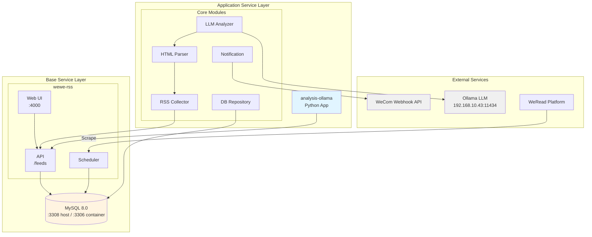
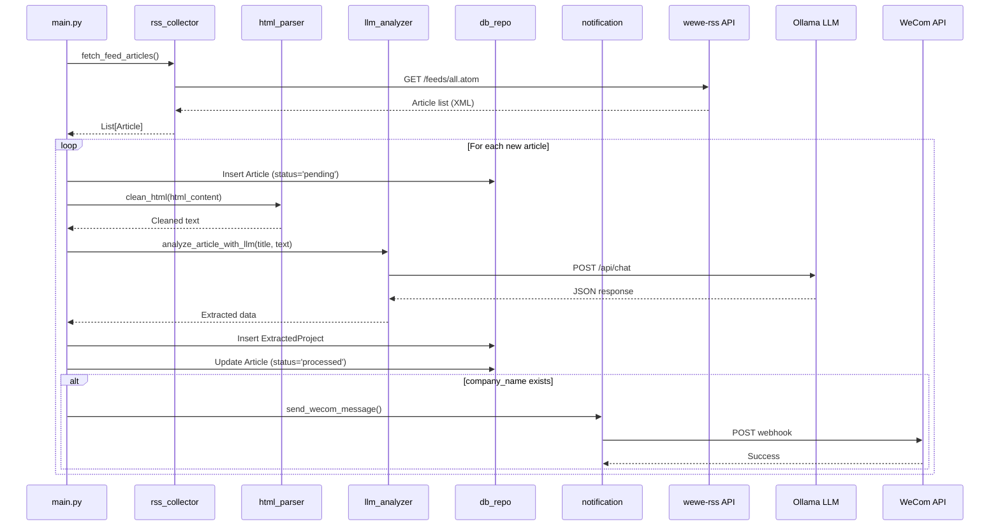

# Architecture Documentation

## Overview

The lepure-business-opportunity (CGT MI Tool) project implements an environment-separated architecture with two distinct layers:

- **Base Service Layer**: wewe-rss and MySQL database running as independent services
- **Application Service Layer**: analysis-ollama supporting dev/pre environment configurations with containerized deployment

## System Architecture

### Overall Architecture Diagram



## Service Communication

### Network Architecture

#### Docker Network
- **Network Name**: `wewe-rss_default` (automatically created by wewe-rss docker-compose)
- **Network Type**: bridge
- **DNS Resolution**: Containers communicate via service names (e.g., `db`, `app`)

#### Service Discovery

**Within wewe-rss:**
- `app` container accesses MySQL via `db:3306`
- Database name: `wewe-rss`

**analysis-ollama -> wewe-rss:**
- Access API via `http://app:4000`

**analysis-ollama -> MySQL:**
- **Dev environment**: `127.0.0.1:3308` (via host port mapping)
- **Pre environment**: `db:3306` (via Docker network)
- Database name: `analysis_ollama`

**Important**: analysis-ollama and wewe-rss use the same MySQL instance but different databases:
- wewe-rss uses `wewe-rss` database
- analysis-ollama uses `analysis_ollama` database

#### External Service Access

- **Ollama**: `http://192.168.10.43:11434` (LAN service)
- **WeCom Webhook**: HTTPS public API
- **WeRead Platform**: `https://weread.965111.xyz`

### Environment-Specific Communication

#### Development Environment

```
┌─────────────────────────────────────────────────────────────┐
│                        Host Machine                          │
│                                                               │
│  ┌────────────────────────────────────────────────────────┐ │
│  │  analysis-ollama Container (dev)                       │ │
│  │  - Mounts: ./analysis-ollama:/app                      │ │
│  │  - Network: wewe-rss_default (external)                │ │
│  │  - Env: .env.dev                                       │ │
│  │  - DB: 127.0.0.1:3308 (via host.docker.internal)      │ │
│  │  - WeWe-RSS: http://app:4000                           │ │
│  └────────────────────────────────────────────────────────┘ │
│                          ▲                                   │
│                          │ Docker Network                    │
│  ┌────────────────────────────────────────────────────────┐ │
│  │  wewe-rss Containers                                   │ │
│  │  ┌──────────────┐  ┌──────────────┐                   │ │
│  │  │  app:4000    │  │  db:3306     │                   │ │
│  │  │              │  │  (->3308)    │                   │ │
│  │  └──────────────┘  └──────────────┘                   │ │
│  └────────────────────────────────────────────────────────┘ │
│                                                               │
│  Local Code: ./analysis-ollama/                              │
│  (Hot reload enabled)                                        │
└─────────────────────────────────────────────────────────────┘
```

#### Pre-production Environment

```
┌─────────────────────────────────────────────────────────────┐
│                        Host Machine                          │
│                                                               │
│  ┌────────────────────────────────────────────────────────┐ │
│  │  analysis-ollama Container (pre)                       │ │
│  │  - Image: analysis-ollama:latest                       │ │
│  │  - Network: wewe-rss_default (external)                │ │
│  │  - Env: .env.pre                                       │ │
│  │  - DB: db:3306 (via Docker network)                    │ │
│  │  - WeWe-RSS: http://app:4000                           │ │
│  └────────────────────────────────────────────────────────┘ │
│                          ▲                                   │
│                          │ Docker Network                    │
│  ┌────────────────────────────────────────────────────────┐ │
│  │  wewe-rss Containers                                   │ │
│  │  ┌──────────────┐  ┌──────────────┐                   │ │
│  │  │  app:4000    │  │  db:3306     │                   │ │
│  │  │              │  │  (->3308)    │                   │ │
│  │  └──────────────┘  └──────────────┘                   │ │
│  └────────────────────────────────────────────────────────┘ │
└─────────────────────────────────────────────────────────────┘
```

## Component Architecture

### analysis-ollama Modules

```
analysis-ollama/
├── config/
│   └── settings.py          # Configuration management (pydantic-settings)
├── core/
│   ├── db_repo.py           # Database connection pool and health check
│   ├── models.py            # SQLAlchemy ORM models
│   ├── rss_collector.py     # RSS article collection
│   ├── html_parser.py       # HTML cleaning and text extraction
│   ├── llm_analyzer.py      # LLM information extraction
│   ├── notification.py      # WeCom notification
│   ├── logger.py            # Structured JSON logging
│   └── health_check.py      # Startup health checks
├── main.py                  # Application entry and scheduler
├── Dockerfile               # Container image definition
├── docker-compose.yml       # Pre environment deployment
└── docker-compose.dev.yml   # Dev environment deployment
```

### Data Flow



## Extensibility Design

### Multi-Feed Support (Future Enhancement)

The architecture is designed to support multiple WeChat official accounts with different webhooks and polling intervals:

#### Feed Configuration Table

```sql
CREATE TABLE IF NOT EXISTS `feed_configs` (
  `id` INT NOT NULL AUTO_INCREMENT,
  `feed_id` VARCHAR(100) UNIQUE NOT NULL,
  `feed_name` VARCHAR(255) NOT NULL,
  `webhook_url` VARCHAR(1024) NOT NULL,
  `poll_interval_minutes` INT DEFAULT 60,
  `enabled` BOOLEAN DEFAULT TRUE,
  `created_at` DATETIME DEFAULT CURRENT_TIMESTAMP,
  `updated_at` DATETIME DEFAULT CURRENT_TIMESTAMP ON UPDATE CURRENT_TIMESTAMP,
  PRIMARY KEY (`id`)
);
```

#### Multi-Feed Collection Strategy

**Current Version (MVP)**:
- Single feed collection (configured via environment variables)
- Single webhook URL
- Fixed polling interval

**Extended Version**:
- Read all enabled feeds from `feed_configs` table
- Collect and process each feed separately
- Each feed can have independent webhook URL and polling interval

#### Implementation Example

```python
# In rss_collector.py (future extension)
def fetch_multiple_feeds():
    """
    Fetch articles from multiple feeds configured in feed_configs table.
    
    Returns:
        Dict[str, List[Dict]]: Articles grouped by feed_id
    """
    session = SessionLocal()
    feed_configs = session.query(FeedConfig).filter(FeedConfig.enabled == True).all()
    
    results = {}
    for config in feed_configs:
        feed_url = f"{settings.WEWE_RSS_URL}/feeds/{config.feed_id}.atom"
        articles = fetch_feed_from_url(feed_url)
        results[config.feed_id] = articles
    
    session.close()
    return results

# In notification.py (future extension)
def send_wecom_message_dynamic(project_data, article_title, article_url, feed_id):
    """
    Send WeCom notification with dynamic webhook routing based on feed_id.
    """
    session = SessionLocal()
    feed_config = session.query(FeedConfig).filter(FeedConfig.feed_id == feed_id).first()
    
    if feed_config:
        webhook_url = feed_config.webhook_url
        # Send to specific webhook
    
    session.close()
```

#### Differentiated Polling Intervals

```python
# In main.py (future extension)
for feed_config in feed_configs:
    schedule.every(feed_config.poll_interval_minutes).minutes.do(
        process_feed, feed_id=feed_config.feed_id
    )
```

### Webhook Routing

- Add `feed_id` field to `ExtractedProject` table to track source feed
- Query `feed_configs` table when sending notifications
- Route to appropriate webhook URL based on feed_id
- Support different WeChat groups for different official accounts

## Error Handling Strategy

### Error Classification

1. **Configuration Errors** (Startup failure)
   - Missing required environment variables
   - Invalid configuration values
   - Action: Log error and exit

2. **Database Connection Errors** (Startup failure)
   - Cannot connect to MySQL
   - Action: Retry 3 times (5 sec interval), then exit

3. **WeWe-RSS API Errors** (Runtime error)
   - Service unavailable, timeout, HTTP errors
   - Action: Log error, skip current cycle, continue running

4. **LLM Analysis Errors** (Runtime error)
   - Ollama unavailable, timeout, JSON parsing error
   - Action: Mark article as 'error', continue to next article

5. **WeCom Notification Errors** (Runtime error)
   - Network error, timeout, HTTP error
   - Action: Log error, don't affect main flow

### Retry Mechanisms

- **Database Connection**: 3 attempts, 5 seconds interval
- **RSS Collection**: No retry, skip current cycle
- **LLM Analysis**: No retry, mark as error
- **WeCom Notification**: No retry, log only

## Logging Strategy

### Structured JSON Logging

All logs are output in JSON format with the following fields:

```json
{
  "timestamp": "2024-01-15T10:30:45.123Z",
  "level": "INFO",
  "module": "core.rss_collector",
  "message": "Successfully fetched 5 articles from RSS feed",
  "context": {
    "feed_url": "http://app:4000/feeds/all.atom",
    "article_count": 5
  }
}
```

### Log Levels

- **DEBUG**: Detailed diagnostic information
- **INFO**: General informational messages
- **WARNING**: Warning messages (non-critical issues)
- **ERROR**: Error messages (operation failed but app continues)
- **CRITICAL**: Critical errors (app cannot continue)

### Log Configuration

- Log level controlled by `LOG_LEVEL` environment variable
- Default: `INFO`
- Logs output to stdout (captured by Docker)
- Log rotation: 10MB max size, 3 files retained

## Health Checks

### Startup Health Checks

1. **Configuration Validation**: Verify all required environment variables
2. **Database Connection**: Verify database is accessible
3. **WeWe-RSS Connectivity**: Optional check, won't fail startup

### Runtime Health Checks

- Docker healthcheck: Execute `SELECT 1` query every 30 seconds
- If healthcheck fails 3 times, container is marked unhealthy

## Security Considerations

1. **Sensitive Configuration**: Store in `.env` files (not in git)
2. **Database Credentials**: Use strong passwords
3. **Webhook URLs**: Keep confidential
4. **Network Isolation**: Use Docker networks for service communication
5. **Log Sanitization**: Don't log sensitive data (passwords, tokens)

## Performance Considerations

1. **Database Connection Pool**: 5 connections, max overflow 10
2. **HTTP Timeouts**: 
   - RSS collection: 30 seconds
   - LLM analysis: 120 seconds
   - WeCom notification: 10 seconds
3. **Content Truncation**: Limit LLM input to 4000 characters
4. **Polling Interval**: Configurable (default 60 minutes)

## Deployment Considerations

1. **Startup Order**: wewe-rss must be started and configured before analysis-ollama
2. **Manual Steps**: User must login to WeRead and subscribe to official accounts
3. **Network Configuration**: analysis-ollama must join wewe-rss Docker network
4. **Environment Variables**: Use separate `.env` files for dev/pre environments
5. **Image Building**: Build image before deploying to pre environment
