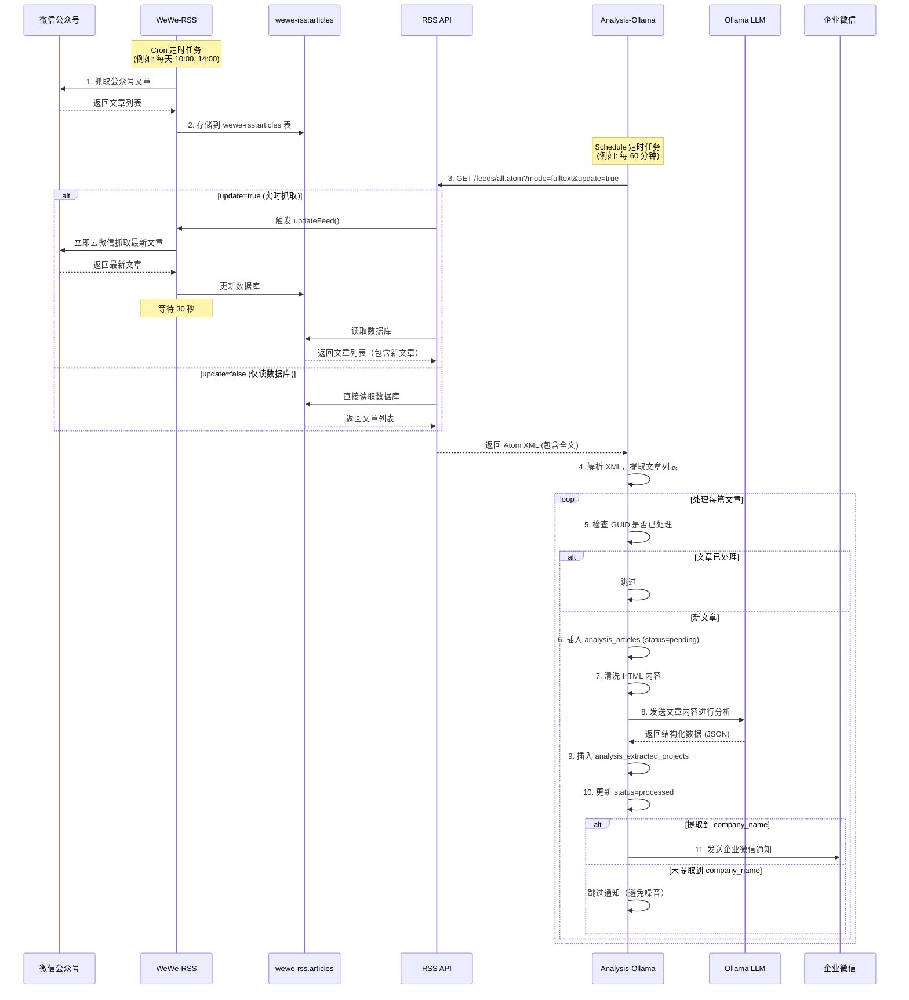

# 数据流和系统逻辑详解

## 系统概述

Analysis-Ollama 是一个**拉取式（Pull）**的数据处理系统，定期从 WeWe-RSS 获取文章，使用 LLM 进行分析，并发送通知。

## 核心概念

### 1. 两个独立的定时任务

| 系统 | 定时任务 | 作用 | 配置位置 |
|------|----------|------|----------|
| **WeWe-RSS** | Cron 定时抓取 | 从微信公众号抓取文章到自己的数据库 | `wewe-rss/.env` 中的 `CRON_EXPRESSION` |
| **Analysis-Ollama** | Schedule 定时轮询 | 从 WeWe-RSS 的 RSS API 拉取文章进行分析 | `analysis-ollama/.env.dev` 中的 `POLL_INTERVAL_MINUTES` |

**关键点**：
- 两个系统的定时任务是**独立的**
- WeWe-RSS 负责抓取原始文章
- Analysis-Ollama 负责分析和处理

### 2. 数据库隔离

| 数据库 | 表 | 用途 |
|--------|-----|------|
| **wewe-rss** | `articles` | WeWe-RSS 存储原始文章 |
| **analysis_ollama** | `analysis_articles` | Analysis-Ollama 存储文章元数据 |
| **analysis_ollama** | `analysis_extracted_projects` | Analysis-Ollama 存储提取的项目信息 |

**注意**：表名使用 `analysis_` 前缀避免冲突！

## 完整数据流



## 详细流程说明

### 阶段 1: WeWe-RSS 抓取（推送源）

```
微信公众号 → WeWe-RSS (Cron) → wewe-rss.articles 表
```

- **触发方式**：Cron 定时任务（例如：`0 10,14 * * *` 每天 10:00 和 14:00）
- **数据存储**：存储在 `wewe-rss` 数据库的 `articles` 表
- **配置位置**：`wewe-rss/.env` 中的 `CRON_EXPRESSION`

### 阶段 2: Analysis-Ollama 拉取（拉取式）

```
Analysis-Ollama (Schedule) → WeWe-RSS RSS API → 获取文章列表
```

- **触发方式**：Python `schedule` 库定时轮询（例如：每 60 分钟）
- **API 端点**：`GET http://localhost:4000/feeds/all.atom?mode=fulltext&update=true`
- **数据格式**：Atom XML（包含全文 HTML）
- **配置位置**：`analysis-ollama/.env.dev` 中的 `POLL_INTERVAL_MINUTES`

**关键参数**：
- `mode=fulltext`：获取完整文章内容（不仅仅是摘要）
- `update=true`：**触发 WeWe-RSS 立即去微信公众号抓取最新文章**

### ⚠️ 重要：`update=true` 的行为

```typescript
// wewe-rss/apps/server/src/feeds/feeds.controller.ts
if (update) {
  this.feedsService.updateFeed(id);  // 触发实时抓取
}
```

**`update=true` 做了什么**：
1. ✓ WeWe-RSS 收到请求后，**立即去微信公众号抓取最新文章**
2. ✓ 调用 `refreshMpArticlesAndUpdateFeed(id)` 方法
3. ✓ 抓取完成后等待 30 秒
4. ✓ 然后返回 RSS feed（包含新抓取的文章）

**数据来源**：
- ❌ **不是**仅从 wewe-rss 数据库读取
- ✓ **是**触发 WeWe-RSS 实时去微信公众号抓取

**流程对比**：

| 参数 | 数据来源 | 流程 |
|------|----------|------|
| `update=false` | wewe-rss 数据库 | RSS API → 读取数据库 → 返回 |
| `update=true` | 微信公众号（实时） | RSS API → 触发抓取 → 微信公众号 → 更新数据库 → 返回 |

**性能影响**：
- `update=true` 会触发实时抓取，响应时间较长（可能 30 秒以上）
- 建议根据实际需求决定是否使用

### 阶段 3: 文章去重（增量处理）

```python
# 通过 GUID 判断文章是否已处理
existing = Article.get_by_guid(session, item['guid'])
if existing:
    logger.debug(f"文章已处理: {item['title']}")
    continue  # 跳过已处理的文章
```

**去重机制**：
- ✓ 使用 `guid` 字段作为唯一标识
- ✓ 数据库中 `guid` 字段有 UNIQUE 索引
- ✓ 每次轮询只处理新文章（增量处理）

**数据特性**：
- RSS API 返回的是**全量数据**（所有文章）
- Analysis-Ollama 通过 GUID 过滤，实现**增量处理**

### 阶段 4: LLM 分析（逐篇处理）

```python
for item in articles:
    # 1. 插入文章记录（防止重复处理）
    new_article = Article(...)
    session.add(new_article)
    session.flush()
    
    # 2. 清洗 HTML
    cleaned_text = clean_html(item['html'])
    
    # 3. LLM 分析（单篇处理）
    extracted_data = llm_service.analyze_article(title, cleaned_text)
    
    # 4. 保存结果
    project = ExtractedProject(...)
    session.add(project)
    
    # 5. 提交事务
    session.commit()
```

**处理方式**：
- ✓ **逐篇处理**（不是批量）
- ✓ 每篇文章独立事务
- ✓ 失败不影响其他文章

**为什么逐篇处理？**
1. LLM 分析耗时较长（可能超时）
2. 单篇失败不影响其他文章
3. 可以实时看到处理进度

### 阶段 5: 通知发送（条件触发）

```python
if extracted_data.get('company_name'):
    notification_service.send_wecom_message(...)
else:
    logger.info("未找到 company_name，跳过企业微信通知以避免噪音")
```

**触发条件**：
- ✓ 只有提取到 `company_name` 才发送通知
- ✓ 避免无关文章产生噪音

## 数据唯一性保证

### 1. GUID 唯一性

```sql
UNIQUE INDEX `idx_guid` (`guid`)
```

- RSS feed 中的每篇文章都有唯一的 `guid`
- 数据库层面保证不会重复插入

### 2. 处理状态

```python
status: str = Field(default='pending')
# 可能的值: 'pending', 'processed', 'error'
```

- `pending`：待处理
- `processed`：已成功处理
- `error`：处理失败

### 3. 事务保护

```python
try:
    # 插入文章
    session.add(new_article)
    session.flush()
    
    # LLM 分析
    extracted_data = llm_service.analyze_article(...)
    
    # 保存结果
    session.add(project)
    session.commit()
except Exception as e:
    session.rollback()
    logger.error(f"处理失败: {e}")
```

## 性能和扩展性

### 当前实现（单 Feed）

```python
# 同步处理单个 feed
articles = rss_service.fetch_feed_articles()  # 获取所有文章
for item in articles:
    # 逐篇处理
    process_article(item)
```

### 未来扩展（多 Feed 并发）

```python
# 异步并发处理多个 feed
feed_articles = await rss_service.fetch_all_feeds_async(max_concurrent=5)
for feed_id, articles in feed_articles.items():
    for item in articles:
        process_article(item)
```

**扩展点**：
- 支持多个公众号（多 feed）
- 异步并发处理
- 不同 feed 使用不同 webhook

## 配置建议

### 🎯 推荐方案: Cron 同步（最优）

**配置 WeWe-RSS**：
```env
# wewe-rss/.env
CRON_EXPRESSION="0 10,14 * * *"  # 每天 10:00 和 14:00 抓取
```

**配置 Analysis-Ollama**：
```env
# analysis-ollama/.env.dev
CRON_SCHEDULE=10:30,14:30  # 每天 10:30 和 14:30 处理（晚 30 分钟）
```

**优点**：
- ✓ **不浪费资源**：只在有新数据时运行
- ✓ **时间可控**：确保 WeWe-RSS 抓取完成
- ✓ **简单高效**：无需频繁轮询

**时间安排建议**：
- WeWe-RSS 抓取时间：10:00, 14:00
- Analysis-Ollama 处理时间：10:30, 14:30（晚 30 分钟）
- 给 WeWe-RSS 留出 30 分钟完成抓取和入库

### 场景 1: WeWe-RSS 已配置 Cron（推荐）

```env
# wewe-rss/.env
CRON_EXPRESSION="0 10,14 * * *"  # 每天 10:00 和 14:00 抓取

# analysis-ollama/.env.dev
POLL_INTERVAL_MINUTES=60  # 每 60 分钟轮询
```

**RSS API 调用**：
```python
# 不使用 update=true，仅读取数据库
feed_url = f"{self.wewe_rss_url}/feeds/all.atom?mode=fulltext"
```

**优点**：
- ✓ 响应快（直接读数据库）
- ✓ 不会频繁触发微信抓取
- ✓ 依赖 WeWe-RSS 的 Cron 定时更新

### 场景 2: 不确定 WeWe-RSS 抓取时间（轮询方式）

```env
# wewe-rss/.env
CRON_EXPRESSION="0 10,14 * * *"  # 每天 10:00 和 14:00 抓取

# analysis-ollama/.env.dev
# 不配置 CRON_SCHEDULE，使用轮询
POLL_INTERVAL_MINUTES=240  # 每 4 小时轮询一次
```

**RSS API 调用**：
```python
# 不使用 update=true，仅读取数据库
feed_url = f"{self.wewe_rss_url}/feeds/all.atom?mode=fulltext"
```

**优点**：
- ✓ 响应快（直接读数据库）
- ✓ 不需要知道 WeWe-RSS 的确切抓取时间

**缺点**：
- ✗ 可能有无效轮询（没有新数据时也会运行）
- ✗ 实时性取决于轮询间隔

### 场景 3: 需要实时性（不推荐）

```env
# wewe-rss/.env
# 可以不配置 Cron 或配置较长间隔

# analysis-ollama/.env.dev
POLL_INTERVAL_MINUTES=30  # 每 30 分钟轮询
```

**RSS API 调用**：
```python
# 使用 update=true，触发实时抓取
feed_url = f"{self.wewe_rss_url}/feeds/all.atom?mode=fulltext&update=true"
```

**缺点**：
- ✗ 响应慢（需要等待抓取完成，30 秒以上）
- ✗ 频繁触发微信抓取（可能被限流）
- ✗ 增加 WeWe-RSS 负载

### 推荐配置对比

| 方案 | 调度方式 | 资源消耗 | 实时性 | 推荐度 |
|------|----------|----------|--------|--------|
| **Cron 同步** | 固定时间执行 | 最低 | 可控 | ⭐⭐⭐⭐⭐ |
| **轮询（长间隔）** | 每 4-6 小时 | 低 | 中 | ⭐⭐⭐ |
| **轮询（短间隔）** | 每 30-60 分钟 | 中 | 高 | ⭐⭐ |
| **实时抓取** | update=true | 高 | 最高 | ⭐ |

**最佳实践**：
1. ✅ 使用 **Cron 同步**方式（`CRON_SCHEDULE`）
2. ✅ Analysis-Ollama 比 WeWe-RSS 晚 30 分钟执行
3. ✅ **不使用** `update=true` 参数（仅读数据库）

这样可以：
- ✓ 保证数据新鲜度（WeWe-RSS 定时更新）
- ✓ 不浪费资源（只在有新数据时运行）
- ✓ 避免频繁触发微信抓取

## 配置对比

### WeWe-RSS 配置

```env
# wewe-rss/.env
CRON_EXPRESSION="0 10,14 * * *"  # 每天 10:00 和 14:00 抓取
```

### Analysis-Ollama 配置

```env
# analysis-ollama/.env.dev
POLL_INTERVAL_MINUTES=60  # 每 60 分钟轮询一次
```

## 常见问题

### Q1: 为什么需要两个定时任务？

**A**: 职责分离
- WeWe-RSS：专注于抓取原始文章
- Analysis-Ollama：专注于分析和处理

### Q2: RSS API 返回的是增量还是全量？

**A**: **全量**，但 Analysis-Ollama 通过 GUID 实现增量处理

### Q3: `update=true` 是什么意思？

**A**: 
- `update=true`：触发 WeWe-RSS **实时去微信公众号抓取**最新文章
- `update=false` 或不传：仅从 WeWe-RSS 数据库读取已有文章

**建议**：
- 如果 WeWe-RSS 的 Cron 已经定时抓取，可以不用 `update=true`
- 如果需要实时性，可以使用 `update=true`（但响应会变慢）

### Q4: LLM 是批量处理还是逐篇处理？

**A**: **逐篇处理**，每篇文章独立事务，失败不影响其他文章

### Q4: 如何避免重复处理？

**A**: 通过 `guid` 字段的 UNIQUE 索引和数据库查询

### Q5: 如何判断文章是否已处理？

**A**: 
```python
existing = Article.get_by_guid(session, item['guid'])
if existing:
    continue  # 跳过
```

### Q6: 表名为什么要加 `analysis_` 前缀？

**A**: 避免与 wewe-rss 数据库的 `articles` 表冲突

## 监控和调试

### 查看处理状态

```bash
# 运行数据库检查脚本
python scripts/check_database.py
```

### 查看日志

```bash
# Dev 环境
tail -f logs/analysis-ollama.log

# Pre 环境（Docker）
docker-compose logs -f
```

### 手动触发处理

```bash
# 直接运行主程序（会立即执行一次）
ENV=dev python -m app.main
```

## 总结

| 特性 | 说明 |
|------|------|
| **数据流向** | 拉取式（Pull）：Analysis-Ollama 主动从 WeWe-RSS 拉取 |
| **定时任务** | 两个独立的定时任务（WeWe-RSS Cron + Analysis-Ollama Schedule） |
| **数据获取** | RSS API 返回全量，通过 GUID 实现增量处理 |
| **处理方式** | 逐篇处理，每篇独立事务 |
| **去重机制** | GUID 唯一索引 + 数据库查询 |
| **表名隔离** | `analysis_articles` 和 `analysis_extracted_projects` |
| **通知条件** | 只有提取到 company_name 才发送通知 |
